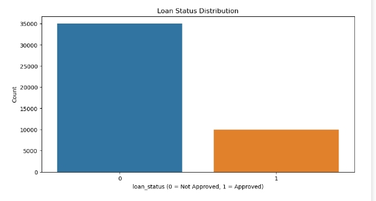
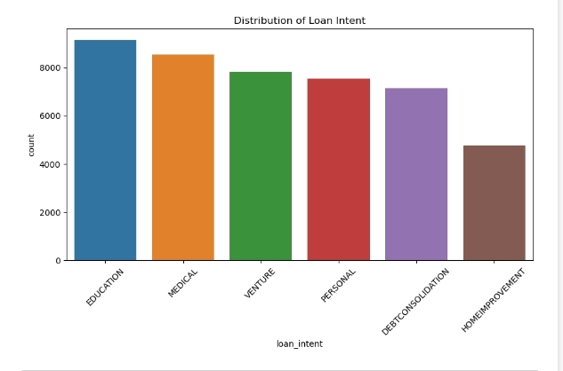
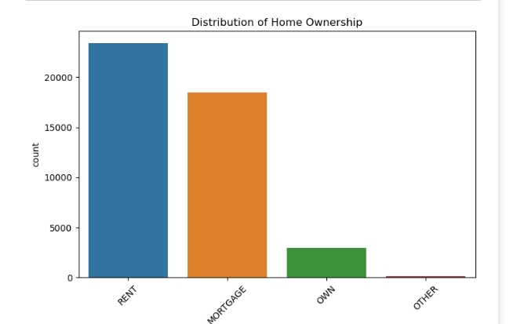

# LOAN-PREDICTION-PROJECT

## 🗒️ Table of Contents
- [Project Overview](#project-overview)  
- [Description](#description)  
- [Problem Statement](#problem-statement)  
- [Project Objective](#project-objective)  
- [Data Source](#data-source)  
- [Dataset Description](#dataset-description)  
- [Tools](#tools)  
- [Methodology](#methodology)  
- [Data Cleaning](#data-cleaning)  
- [Summary Statistics Interpretation](#summary-statistics-interpretation)  
- [Visual Insights](#visual-insights)  
- [Multicollinearity Check (VIF)](#multicollinearity-check-vif)  
- [Handling Multicollinearity](#handling-multicollinearity)  
- [Logistic Regression Model](#logistic-regression-model)  
- [Predictors Interpretation](#predictors-interpretation)  
- [Model Evaluation](#model-evaluation)  
- [Recommendation](#recommendation)  
- [Acknowledgement](#acknowledgement)  
- [Contact](#contact)

  ## 📌 Project Overview
A machine learning project to predicts **whether a loan application will be approved or not** based on applicant details such as age, income, employment, credit history, and loan details.  
It uses **Logistic Regression**, a statistical model, to make predictions.

## 📝 Description
Financial institutions like banks and loan companies face the challenge of deciding **who should be given a loan**. Poor lending decisions can lead to defaults.  
This project provides a **data-driven approach** to help lenders make informed decisions.

## ❓ Problem Statement
Loan default is one of the biggest challenges faced by financial institutions. Traditional manual methods of assessing applications are time-consuming and may overlook important patterns in customer data. This leads to high rejection rates, approval of risky applicants, and loss of potential revenue. To address this, a data-driven approach is required to analyze customer attributes and build a predictive system that can improve decision-making, reduce risks, and ensure fair loan approvals.

## 🎯 Project Objective
To develop a **predictive model** that accurately determines **loan approval** based on applicant attributes.

## 📂 Data Source
The dataset was obtained from kaggle website, here's the link to the dataset: https://www.kaggle.com/datasets/taweilo/loan-approval-classification-data

## 📊 Dataset Description
The dataset used is a loan application dataset containing **45,000 records** and **14 features**.  

- **Target variable:** loan_status (0 = Not Approved, 1 = Approved)

- **Independent variables:** applicant’s demographics, loan details, and credit history.

| Feature | Description |
|---------|-------------|
| person_age | Age of applicant |
| person_gender | Gender of applicant |
| person_education | Education level |
| person_income | Annual income |
| person_emp_exp | Employment experience (years) |
| person_home_ownership | Home ownership status |
| loan_amnt | Loan amount requested |
| loan_intent | Loan purpose (Education, Medical, etc.) |
| loan_int_rate | Loan interest rate (%) |
| loan_percent_income | Loan-to-income ratio |
| cb_person_cred_hist_length | Credit history length (years) |
| credit_score | Credit score of applicant |
| previous_loan_defaults_on_file | Past default record (Yes/No) |
| loan_status | Target variable (0 = Not Approved, 1 = Approved) |

## 🛠 Tools
- **Python** (Pandas, NumPy, Matplotlib, Seaborn)

- **Scikit-learn** (Logistic Regression, preprocessing, evaluation)

- **Statsmodels** (VIF for multicollinearity checks)

## 🔍 Methodology
1. Data Cleaning: Handle missing values, duplicates, inconsistent data.

2. Exploratory Data Analysis (EDA): Understand data patterns using statistics and visualizations.

3. Multicollinearity Check: Ensure predictors are not too closely related.

4. Model Building: Train a Logistic Regression model.

5. Model Evaluation: Check accuracy, precision, recall, ROC-AUC.

## 🧹 Data cleaning 
- No missing values found.

- No duplicate records.

- Encoded categorical variables (gender, education, loan intent, etc.) into numbers.

## 📈 Summary Statistics Interpretation
- **Average age = 28 years** → mostly young applicants.  
- **Average income = 80,000**.  
- **Loan amounts ranged from 500 – 35,000.**  
- **Credit scores mostly between 600 – 850.**  
- About **22% of applicants were approved** (`loan_status = 1`), while **78% were rejected** (`loan_status = 0`).

## 📊 Visual insights 

**Loan Status Distribution**  
  - Majority of applicants (78%) had their loans **not approved**.  
  - Only about 22% were **approved**, showing that lenders are more conservative in approvals.
    

**Loan Intent**  
  - Most loan applications were for **medical, education, and personal use**.  
  - This shows that many applicants borrow for essential needs (health, school) and personal expenses.  

**Education Level**  
  - Majority of applicants had **Bachelor’s education**.  
  - Applicants with **Master’s and Doctorate degrees** were fewer but still significant.
    

**Home Ownership**  
- Most applicants were **renters**, followed by those with a **mortgage**.  
- Few applicants fully owned their homes, showing higher dependency on borrowed housing.

## 📉 Multicollinearity Check (VIF)

Variance Inflation Factor (VIF) was calculated to detect multicollinearity among predictors:

| Feature                        | VIF       | Interpretation |
|--------------------------------|-----------|----------------|
| const                          | 379.91    | ❌ Very high (ignored, constant term) |
| person_age                     | 14.12     | ❌ High multicollinearity |
| person_gender                  | 1.00      | ✅ No multicollinearity |
| person_education               | 1.00      | ✅ No multicollinearity |
| person_income                  | 1.44      | ✅ Acceptable |
| person_emp_exp                 | 11.27     | ❌ High multicollinearity |
| person_home_ownership          | 1.16      | ✅ Acceptable |
| loan_amnt                      | 2.20      | ✅ Acceptable |
| loan_intent                    | 1.00      | ✅ No multicollinearity |
| loan_int_rate                  | 1.08      | ✅ Acceptable |
| loan_percent_income            | 2.21      | ✅ Acceptable |
| cb_person_cred_hist_length     | 3.93      | ✅ Moderate, acceptable |
| credit_score                   | 1.07      | ✅ Acceptable |
| previous_loan_defaults_on_file | 1.13      | ✅ Acceptable |

### 🔎 Interpretation
- **Threshold:** A VIF > 10 indicates **high multicollinearity**.  
- `person_age (14.12)` and `person_emp_exp (11.27)` show **serious multicollinearity** ❌.  
- Most other predictors have **VIF < 5**, meaning they are acceptable ✅.  

## 🛠 Handling Multicollinearity

From the VIF analysis:

- `person_age` (VIF = 14.12) and `person_emp_exp` (VIF = 11.27) showed **high multicollinearity** ❌.  
- Logistic regression significance testing showed `person_emp_exp` was **not statistically significant** (high p-value).  
- To improve model stability, we **dropped `person_emp_exp`** from the dataset.  

### ✅ Updated VIF After Dropping `person_emp_exp`

| Feature                        | VIF   | Interpretation |
|--------------------------------|-------|----------------|
| const                          | 226.95 | ❌ Very high (ignored, constant term) |
| person_age                     | 4.05   | ✅ Acceptable |
| person_gender                  | 1.00   | ✅ No multicollinearity |
| person_education               | 1.00   | ✅ No multicollinearity |
| person_income                  | 1.44   | ✅ Acceptable |
| person_home_ownership          | 1.16   | ✅ Acceptable |
| loan_amnt                      | 2.19   | ✅ Acceptable |
| loan_intent                    | 1.00   | ✅ No multicollinearity |
| loan_int_rate                  | 1.08   | ✅ Acceptable |
| loan_percent_income            | 2.21   | ✅ Acceptable |
| cb_person_cred_hist_length     | 3.93   | ✅ Moderate, acceptable |
| credit_score                   | 1.07   | ✅ Acceptable |
| previous_loan_defaults_on_file | 1.13   | ✅ Acceptable |

### 🔎 Interpretation
- After dropping `person_emp_exp`, **all remaining variables have VIF < 5**, which is within the safe range.  
- This reduces redundancy and ensures that predictors provide **unique information** to the logistic regression model.

## 📌 Logistic Regression Coefficients & Interpretation

| Feature                        | Coefficient | Odds Ratio | Interpretation |
|--------------------------------|-------------|------------|----------------|
| person_age                     | 0.0761      | 1.0791     | ✅ Slight increase in age increases approval odds (not a strong effect). |
| person_gender                  | 0.0081      | 1.0082     | ⚪ Gender has almost no effect on loan approval. |
| person_education               | 0.0014      | 1.0014     | ⚪ Education level does not strongly influence approval. |
| person_income                  | 0.0200      | 1.0202     | ✅ Higher income slightly increases chances of approval. |
| person_home_ownership          | 0.3339      | 1.3964     | ✅ Applicants who own/mortgage homes are ~1.4× more likely to be approved. |
| loan_amnt                      | -0.5451     | 0.5798     | ❌ Higher loan amounts reduce approval odds. |
| loan_intent                    | -0.2674     | 0.7653     | ❌ Certain loan purposes are less likely to be approved. |
| loan_int_rate                  | 0.9887      | 2.6878     | ✅ Higher interest rates strongly increase approval likelihood (banks approve but charge more risk premium). |
| loan_percent_income            | 1.2783      | 3.5905     | ✅ Applicants with smaller loan-to-income ratios are **3.6× more likely** to be approved. |
| cb_person_cred_hist_length     | -0.0388     | 0.9619     | ❌ Longer credit history slightly reduces approval odds (not a big effect). |
| credit_score                   | -0.4581     | 0.6325     | ❌ Lower credit scores reduce approval likelihood. |
| previous_loan_defaults_on_file | -4.4903     | 0.0112     | 🚨 Past loan defaults **drastically reduce** approval chances. |

## 📌 Overall Insights

### ✅ Most Important Positive Predictors
- **Loan-to-Income Ratio** (OR = 3.59)  
- **Loan Interest Rate** (OR = 2.69)  
- **Home Ownership** (OR = 1.40)  

### ❌ Most Important Negative Predictors
- **Past Loan Defaults** (OR = 0.01 🚨)  
- **Loan Amount** (OR = 0.58)  
- **Low Credit Score** (OR = 0.63)  

### ⚪ Weak/No Impact Predictors
- **Gender**  
- **Education**  
- **Age** (small effects only)  

 **In simple words:**  
Banks approve applicants who **borrow within their means, have stable housing, and no history of default**.  
They reject applicants with **large loan requests, poor credit, or past defaults** regardless of age, gender, or education.

## ✅ Model Evaluation

### 📊 Accuracy
- Overall Accuracy: **0.89 (89%)**

### 📑 Classification Report

| Class (Loan Status) | Precision | Recall | F1-Score | Support |
|----------------------|-----------|--------|----------|---------|
| 0 (Not Approved)    | 0.92      | 0.93   | 0.93     | 10,493  |
| 1 (Approved)        | 0.76      | 0.74   | 0.75     | 3,007   |
| **Overall / Avg**   | **0.89**  | **0.89** | **0.89** | 13,500  |

### 🔲 Confusion Matrix

|                  | Predicted: 0 | Predicted: 1 |
|------------------|--------------|--------------|
| **Actual: 0**    | 9803         | 690          |
| **Actual: 1**    | 795          | 2212         |

- **True Negatives (9803):** Correctly predicted loan rejections.  
- **True Positives (2212):** Correctly predicted loan approvals.  
- **False Positives (690):** Predicted approved, but actually rejected.  
- **False Negatives (795):** Predicted rejected, but actually approved.  

### 📈 ROC-AUC Score
- **ROC-AUC = 0.95** → The model has excellent discrimination ability between approved and not approved loans.

### 🔎 Interpretation
- The model performs **very well overall (89% accuracy)**.  
- It is **more accurate at predicting rejections (Class 0)** than approvals (Class 1).  
- Precision and Recall for loan approvals are slightly lower (0.76 and 0.74), meaning some approved loans are still being misclassified.  
- The high ROC-AUC (0.95) confirms strong performance in distinguishing between approved and rejected cases.

## 🔄 Cross-Validation Results

To ensure the model’s performance was not due to overfitting, **5-fold cross-validation** was applied.  

### 📊 Fold Accuracies
- Fold 1: **0.8842**  
- Fold 2: **0.8946**  
- Fold 3: **0.8790**  
- Fold 4: **0.8937**  
- Fold 5: **0.8993**  

### 📌 Mean CV Accuracy
- **0.8902 (≈ 89%)**

### 🔎 Interpretation
- The cross-validation accuracies are **very consistent** (all around 88–90%).  
- The small variation across folds shows the model is **stable and generalizes well**.  
- Confirms that the Logistic Regression model is **reliable and not overfitted**.

## ✍️ Recommendation
- The model shows strong performance (Accuracy = 89%, ROC-AUC = 0.95) and can be reliably used as a **first-level loan screening tool**.  
- Lenders can use it to **automatically flag high-risk applicants**, saving time and reducing financial risk.  
- Strong predictors such as **credit score, loan-to-income ratio, and past defaults** should be given higher weight in decision-making.  
- Applicants with borderline cases (e.g., average credit score but no past defaults) should undergo **manual review** instead of outright rejection.

## 🙏 Acknowledgement

This project is made possible using publicly available loan data from **Kaggle**.  
Special thanks to the dataset contributors for sharing valuable financial data that supports learning and research in credit risk assessment and predictive modeling.  

This project is developed for **educational and portfolio purposes only**.

## 📞 Contact

👤 Created by **Ajirola Amudat** | Data Science & Analytics Enthusiast
🔗 [LinkedIn](https://www.linkedin.com/in/ajirolaamudat)

📫 For questions or collaborations: [Send a message](https://www.linkedin.com/in/ajirolaamudat)

  

